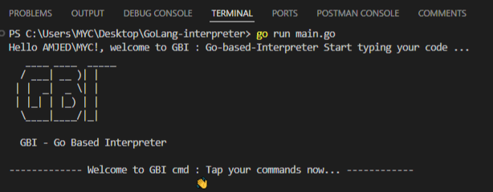

# GBI - Go Based Interpreter
An interpreter built using GoLang including a lexer, parser, and evaluator inspired by Thorsten Ball's " Writing an Interpreter in Go ".




## Overview
GBI (Go Based Interpreter) is an interpreter built using GoLang, featuring a lexer, parser, and evaluator inspired by Thorsten Ball's *Writing an Interpreter in Go*.
---

## Features
- **Variables**: Support for integers, booleans, strings, and undefined types.
- **Functions**: Define and call reusable functions.
- **Conditionals**: If-else constructs for decision-making.
- **Loops**: For loops to perform repeated actions.

---

## Getting Started

### Prerequisites
- Install [Go](https://golang.org/dl/) (latest stable version recommended).

### Installation
1. Clone the repository:
   ```bash
   git clone https://github.com/AmjedChakhis/GoLang-interpreter.git
   ```

2. Navigate to the repository directory:
   ```bash
   cd GoLang-interpreter
   ```

3. Run the interpreter:
   ```bash
   go run main.go
   ```

4. Start using the interpreter directly in the terminal.

---

## GBI Documentation

### Variables

#### Supported Data Types
- **Integers**
- **Booleans**
- **Strings**
- **Undefined**

#### Defining Variables

- **Syntax**:
  ```
  def <variable_name> = <value>;
  ```
- **Examples**:
  ```
  def a = 10;      # Integer
  def b = true;     # Boolean
  def c = "hello"; # String
  ```

### Functions

#### Syntax
```
function <function_name>(<arguments>) { <function_body> ;}
```

#### Example
```
function add(a, b) { return a + b ;}
```

#### Calling Functions
- **Syntax**:
  ```
  <function_name>(<arguments>);
  ```
- **Example**:
  ```
  add(10, 20);
  ```

### If Statements

#### Syntax
```
if (<condition>) { <body> ;} else { <else_body> ;}
```

#### Example
```
if (a == 10) { return true ;} else { return false ;}
```

### Loops

#### For Loops

- **Syntax**:
  ```
  for (<initialization>; <condition>; <increment>) { <body> ;}
  ```
- **Example**:
  ```
  for (def i = 0; i <= 10; i++) { if (i == 3) { return 3; }}
  ```
---

## Acknowledgments
- Inspired by Thorsten Ball's *Writing an Interpreter in Go*.
